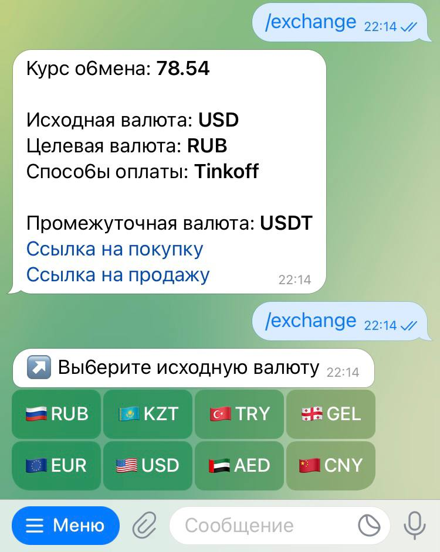
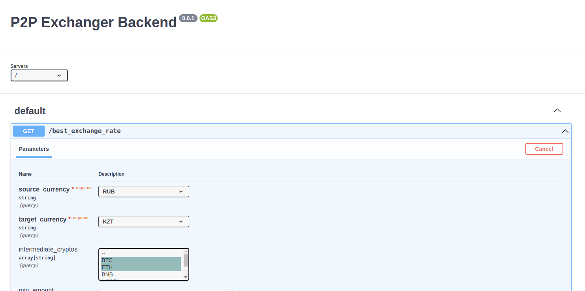

# P2P Exchanger

Backend project on `python`.

# Telegram Bot

## Local run

Run bot with polling mode with the following command:

```shell
python src/interfaces/aiogram/main.py start_polling
```

## Production run

Run bot with webhook mode with the following command:

```shell
python src/interfaces/aiogram/main.py start-webhook
```

Or run via `docker-compose.yml`:

```shell
docker-compose up bot
```

### Preview



# API

## Local run

With this command API will be available on `http://localhost:8000`

```shell
uvicorn src.interfaces.starlite.main:app --reload
```

Or run via `docker-compose.yml`

```shell
docker-compose up backend
```

## OpenAPI

### Preview



By default, for the `Starlite` server, the `Swagger` is available on `host:port/schema` (`http://localhost:8000/schema`)

# Testing

Run unit-tests and coverage report with command

```shell
pytest --cov=src tests/
```

Also, you can run all linters at once with `pre-commit` by following command:

```shell
pre-commit run --all-files
```
